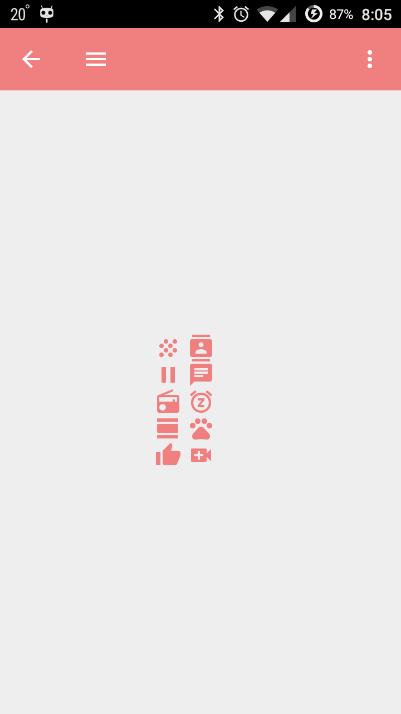
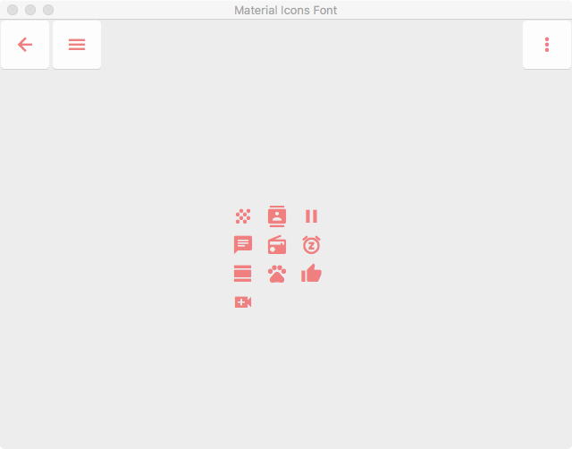
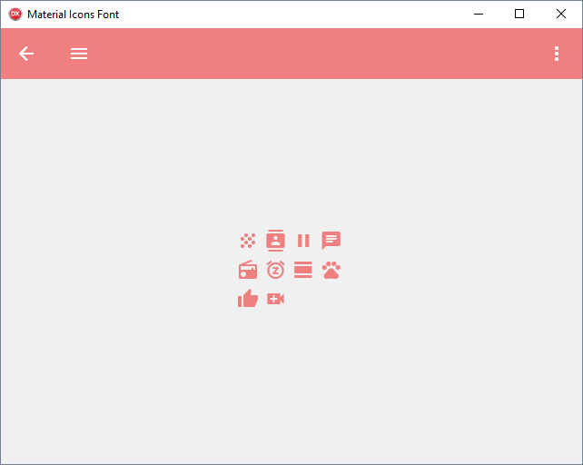

# FMX.MaterialIconsFont
[FireMonkey] Material Design Icons 3.0.1
https://material.io/icons/

Based on FMX.FontAwesome by ZuBy, 2017
https://github.com/rzaripov1990/FMX.FontAwesome

## ANDROID
* Include `FMX.FontGlyphs.pas` and `FMX.FontGlyphs.Android.pas` to project
* Deploy font to project

## MACOS
* Deploy font to project to the `Contents\Resources\Fonts` folder

* Choose `Project | Options` and click `Version Info`. Then right click in the `Key/Value` area and choose `Add Key`. Set the key name to `ATSApplicationFontsPath`. Set the value to `Fonts`. Click `OK`.

## WINDOWS
* Install font to system

